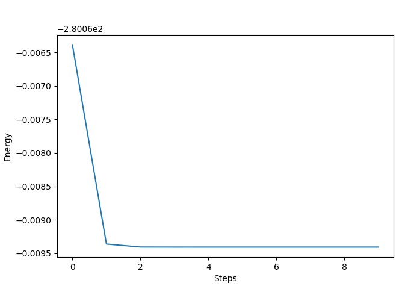

..
    The turbomoleio package, a python interface to Turbomole
    for preparing inputs, parsing outputs and other related tools.

    Copyright (C) 2018-2021 BASF SE, Matgenix SRL.

    This file is part of turbomoleio.

    Turbomoleio is free software: you can redistribute it and/or modify
    it under the terms of the GNU General Public License as published by
    the Free Software Foundation, either version 3 of the License, or
    (at your option) any later version.

    Turbomoleio is distributed in the hope that it will be useful,
    but WITHOUT ANY WARRANTY; without even the implied warranty of
    MERCHANTABILITY or FITNESS FOR A PARTICULAR PURPOSE. See the
    GNU General Public License for more details.

    You should have received a copy of the GNU General Public License
    along with turbomoleio (see ~turbomoleio/COPYING). If not,
    see <https://www.gnu.org/licenses/>.

.. _datagroup_files:

====================
The data group files
====================

Most of the input and output files in TURBOMOLE are structured as a list of data groups separated
by a ``$`` symbol.  (e.g. ``$coord``). The initial part of the of each group usually determines the type of
data with optional values that might be defined on the same line or on subsequent lines.
In turbomoleio a basic object is implemented to allow the parsing and writing of generic data groups files,
with a set of subclasses to interact with selected types of file that require specific functionalities
(e.g. the ``control`` file).

The DataGroups object
=====================

The most basic object to interact with data group files is :class:`turbomoleio.core.datagroups.DataGroups`.
It keeps an internal representation of the file given by a list of data groups, i.e. of strings that should
contain a single data group and start with ``$``, stored in the ``dg_list`` attribute.
Given the TURBOMOLE (lack of) conventions (i.e. the keyword can be one or more words separated by
spaces and there is no complete list of the possible keywords available), the defining keyword at the
beginning of the data group cannot be identified unambiguously.
For this reason all the methods in the ``DataGroups`` objects and its subclasses make a distinction between
the defining keyword (referred as ``data_group``) and its value (the ``data_block``), but this is done just
by matching the value of ``data_group`` with the beginning of each string in ``dg_list`` and no validation
is performed on the names provided.

When reading from an existing data group file to generate an instance of ``DataGroups`` the list of
data groups will be extracted by parsing the content of the file, while cleaning it up of the superfluous
parts, trying to reduce the content of the object to just the data relevant to TURBOMOLE. In particular
the following steps are applied:

* remove everything before the first dollar ("$") sign
* remove blank lines
* remove spaces and tabs before the ``#`` comments
* remove spaces and tabs before the ``$`` signs
* remove comments, both with a full line (i.e lines starting with ``#``) and inline (e.g. ``$uhf # this is an comment``)
* remove all the ``$dummy`` data groups
* remove all the lines after the ``$end`` data group
* split the data groups based on the ``$`` symbol

While it is apparently not strictly required by TURBOMOLE, in turbomoleio the presence of the final
``$end`` data group, marking the end of the data groups list, is mandatory. Parsing files with the
missing keyword will result in an error. Note that, while some other checks are also performed while
parsing a file, if the file is not automatically generated by TURBOMOLE, it is responsibility of the
user to verify that the format is correct. In addition the full initial string is stored under the
``string`` attribute. This value however is never updated when the list of data groups is
modified, so it should just be used as a reference for the initial content of a parsed file.

An instance of ``DataGroups`` can be written to a file with the ``to_file`` method that will
contain only the data included in the ``dg_list``.
The object also offers a series of methods to view and modify the data groups present in the list.
These are inspired from the standard scripts distributed with TURBOMOLE, but are entirely implemented
in python and may have some differences in their behavior, in addition to have some more options.
Note that, while the examples provided below are based on a ``control`` for simplicity, the methods
can be applied to any file structured with data groups.

Accessing a data group value
----------------------------

The method to get the value of a data group is ``show_data_group`` with its shortcut ``sdg``.
The ``data_group`` string in input will be used to match the beginning of the elements of ``dg_list``.
Note that the leading ``$`` symbol is optional, if missing from ``data_group`` it will be added
internally before trying to match the data groups. The ``strict`` argument means that there should be
an *exact* match with the element of the list (i.e. if the data group to be removed is followed by
a space, a tab, a new line or a return). To avoid ambiguities only one value matching the ``data_group``
can be present in the list. If more than one are encountered an exception is raised. The method will
return the string following the matched value of ``data_group``. In case no matching is found
instead the ``default`` value is returned.

A particular case is given by the data groups whose value is contained in another file. A typical example
in the ``control`` file is for example::

    $coord    file=coord

In this case ``show_data_group`` can be asked to open the file with name ``coord`` and return the content
of the ``$coord`` data group there, instead of returning simply ``file=coord``. This will happen if the
``show_from_subfile`` is set to True (the default). If such a file is not present in the current working
directory the ``file=coord`` string will be returned.

.. warning::

    The subfile used to read a datagroup is the one in the working directory where the python
    code is being executed. Always make sure that you are in the correct folder of the file that
    you intent to read.

In some cases a data group can contain different options that are being set. Consider for example the
``$dft`` data group::

    $dft
       functional b-p
       gridsize   m3

You might be interested in extracting the value of the functional. In this case you can use the
the ``show_data_group_option`` method (and the ``sdgo`` shortcut) providing both the ``data_group``
and the ``option`` that should be matched:

.. code-block:: python

    dg.show_data_group_option(data_group="dft", option="functional")

In this case the code will return `` b-p``. Since also for these kind of options the conventions
are not uniform in TURBOMOLE (e.g. the name of the option and the value can be separated by a ``=``)
the support offered by this method are relatively limited. The code
will just check among the lines in the ``$dft`` data group if one starts with the specified
``option`` are return the remaining string contained in the line.

.. _mod_data_group:

Modifying a data group value
----------------------------

Different methods allow to change the values of the ``dg_list``.
The first considered is ``kill_data_group`` (or its shortcut ``kdg``) that allows to remove an element from
``dg_list``. The ``data_group`` and ``strict`` arguments have the same meaning as in ``show_data_group``,
but here **all** the data groups matching will be removed from the list. For example:

.. code-block:: python

    dg.kill_data_group("$thi", strict=False)

removes both ``$thize`` and ``$thime`` from a data groups list, while with ``strict=True`` none
of them is removed.

The next operation available is to add a new datagroup with ``add_data_group`` (or its shortcut ``adg``).
This adds an element to the list given by the ``data_group`` string (with a prepended ``$``, if not already
present) joined with the ``data_block`` string. The new element will be added at the end of the list, but
before the ``$end`` data group. Note that if you want to add a data group with no explicit
value you need to provide an empty string as ``data_block``. For example:

.. code-block:: python

    dg.add_data_group("$symmetry", "c1")
    dg.add_data_group("uhf", "")

The ``change_data_group`` (and its shortcut ``cdg``) changes the value of the `data_group` to
the new ``data_block`` value. The method first performs a
``kill_data_group`` with ``strict=True`` and then ``add_data_group``. The side effect is
that the changed datagroup will be moved to the end of the ``dg_list``. The data group will
be added if not already present. If `data_block` is ``None`` only the ``kill_data_group`` will
be applied. To set a data group with no explicit value use an empty string for `data_block`. Examples:

.. code-block:: python

    # change $scfiterlimit to 100
    dg.change_data_group("$scfiterlimit", "100")
    # remove $scfconv (equivalent to dg.kill_data_group("scfconv")
    dg.change_data_group("scfconv", None)

.. note::

    The ``data_block`` argument of ``add_data_group`` and ``change_data_group`` should be a string,
    i.e. if the data block is a number, it should be the string representation of that number, as
    shown above with "$scfiterlimit" set to "100".

Lastly, you have a method to modify the options contained in a data group. As for the ``show_data_group_option``
method, also ``modify_data_group_options`` (shortcut: ``mdgo``) has some limitations.
The ``data_group`` will be used to match the data group, while the ``options`` argument should be a dictionary
where the keys are used to identify the line that should be modified (much like ``show_data_group_option``)
but the values should contain the **whole line that will replace the original one**
In connection with the ``$dft`` example one can run

.. code-block:: python

    options = {"functional": "functional pbe"}
    dg.modify_data_group_options(data_group="dft", options=options)

This will modify the data group in the object to look like this::

    $dft
       functional pbe
       gridsize   m3

In a similar way to ``change_data_group`` if the value is None the line will be removed, if the option has no
explicit value the value in the dictionary should be set to an empty string. If no line is matching the key
of the option a new line with the value will be added. If no data group is matching the ``data_group`` value
the data group will be added to the list with the specified options only.

.. warning::
    Note that **these methods will act on the list in the object and not on the file from which they were parsed**.
    If you need to update a file you should call the ``to_file`` method after modifying the list in the
    object.

.. _control_object:

The Control object
==================

An important subclass of ``DataGroups`` is :class:`turbomoleio.core.control.Control`. This is specifically
designed to interact with the ``control`` file providing additional functionalities besides the one
described for the basic data groups files. Different options are available to extract frequently
accessed data groups (e.g. the ``get_charge`` method) or to set specific group of options (e.g.
``set_disp`` to specify the dispersion correction). The list of such methods is likely to increase
over time, so the best option is to directly check its API. A few methods however need a particular
attention.

First we can consider the ``energy`` and ``gradient`` attributes, that read the data from the
``$energy`` and ``$gradient`` data groups, respectively and generate instances of the
:class:`turbomoleio.core.control.Energy` and :class:`turbomoleio.core.control.Gradient` objects.
These will not only provide the parsed numerical values of the energies and gradients organized
in lists, but also offer some methods for analysing and plotting the data. For example the
evolution of the energy during the steps of a geometry optimization can be obtained with:

.. code-block:: python

    c = Control.from_file("control")
    c.energy.plot()

Another important method is ``get_shells`` that extracts the list of occupied shells
divided according to the irreducible representation from the the ``alpha/beta/closed shells``
data groups and generate an instance of the :class:`turbomoleio.core.control.Shells` object.
This is used to generate the list of occupied states.

Finally we mention the ``cpc`` that reproduces the ``cpc`` script command available in
TURBOMOLE. Note that this does not call the original script, but it is a python implementation
that reproduces a similar effect.

It should also be noted that the :mod:`turbomoleio.core.control` module contains a set of functions
that allow to directly access and modify a control file without passing explicitly through the object.
The ``sdg``, ``kdg``, ``cdg``, ``sdgo``, ``mdgo`` and ``cpc`` functions read the file from
the specified path and convert it to a ``Control`` object, apply the corresponding method
and, if needed, directly write the modified version to the file system. Note that since these
operations all use the ``Control`` object you will still have all the side effects of parsing
a data group file mentioned above (e.g. removing the comments).

