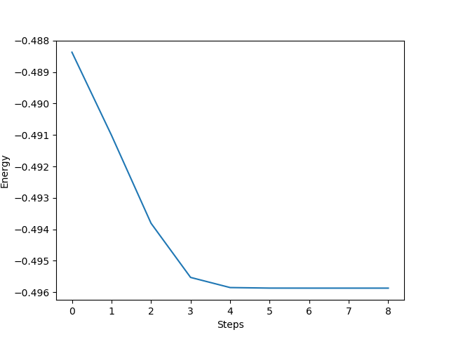

..
    The turbomoleio package, a python interface to Turbomole
    for preparing inputs, parsing outputs and other related tools.

    Copyright (C) 2018-2021 BASF SE, Matgenix SRL.

    This file is part of turbomoleio.

    Turbomoleio is free software: you can redistribute it and/or modify
    it under the terms of the GNU General Public License as published by
    the Free Software Foundation, either version 3 of the License, or
    (at your option) any later version.

    Turbomoleio is distributed in the hope that it will be useful,
    but WITHOUT ANY WARRANTY; without even the implied warranty of
    MERCHANTABILITY or FITNESS FOR A PARTICULAR PURPOSE. See the
    GNU General Public License for more details.

    You should have received a copy of the GNU General Public License
    along with turbomoleio (see ~turbomoleio/COPYING). If not,
    see <https://www.gnu.org/licenses/>.

.. _parsing_outputs:

===============
Outputs parsing
===============

This section describes the general approach used for the parsing of outputs produced by TURBOMOLE.
In particular here we focus mainly on the text output that is written in the ``stdout``. In the following
we will consider that this output is written in a file name ``name_of_the_executable.log``.

Since some outputs are stored in files structured with data groups you can also use the ``DataGroups``
object described in :ref:`datagroup_files`. The information from there will only be just parsed as
strings though and most of information should be extracted from the log files using the objects
described below.

Lastly we will also deal below with the methods to extract the list of states from the outputs of
a calculation. This does not rely on the parsing of the log files.

The log files
=============

Quick Start
-----------

Before digging in the details of how the objects are organized it will be good to have a quick look
at how you can use the objects available and a few examples of the data that they can extract.
If you instead prefer to have an idea about the structure of the object you can first
check the :ref:`parsing_outputs_overall_logs` section and then come back here to the examples.

The most important method to parse your output file is the ``from_file`` class method. All the data
and file objects can be created using it.

Starting with a basic example of an RIDFT calculation, for which the ``ridft.log`` file is the
output of the calculation, you can extract the relevant data (in the form of a data object) in
the same manner. For example, the final energy (as well as its decomposition into its different
contributions) is obtained using the :class:`turbomoleio.output.data.ScfEnergiesData` object:

.. code-block:: python

    >>> from turbomoleio.output.data import ScfEnergiesData
    >>> energy_data = ScfEnergiesData.from_file('ridft.log')
    >>> energy_data
    <turbomoleio.output.data.ScfEnergiesData at 0x7fb15f425eb8>

    >>> print(energy_data.total_energy)
    -0.49586861429
    >>> print(energy_data.virial_theorem)
    1.42945116692

Similarly, the complete information of this same RIDFT calculation can be gathered in an ``ScfOutput``
object. This object contains a series of *basic* data objects (such as the above ``ScfEnergiesData``).
An instance of ``ScfOutput`` can be generated using the following procedure:

.. code-block:: python

    >>> from turbomoleio.output.files import ScfOutput
    >>> scf_output = ScfOutput.from_file('ridft.log')

You can access the basic data objects through different attributes. For example, you have access
to the above ``ScfEnergiesData`` object from the ``energies`` attribute:

.. code-block:: python

    >>> print(scf_output.energies.total_energy)
    -0.49586861429

You can also have access to the SCF iterations of the calculations:

.. code-block:: python

    >>> iterations = scf_output.scf.iterations
    >>> iterations
    <turbomoleio.output.data.ScfIterationData at 0x7fd37d6282b0>

So-called *helper functions* are available for the different data objects. For example, from
the ``ScfIterationData`` object above, you can directly have a plot of the convergence:

.. code-block:: python

    >>> iterations.plot_energies()

.. _parsing_outputs_overall_logs:

Overall Structure
-----------------

The code that performs the parsing is organized on three levels.
At the lowest level there is a generic :class:`turbomoleio.output.parser.Parser` object that
takes the string of the file and is only focused on the extraction of information.
This has several properties, each one tailored to parse specific subsections of the text and extract the relevant data
using regular expressions. The properties return a dictionary with the data that have
been extracted or None, if the section that it should parse could not be found in the string.
In addition these properties are *lazy*, in the sense that they will store the output before returning it
and if called again they will not repeat the parsing.
The ``Parser`` object, although it can be easily used to extract some punctual information, is probably less
useful to the generic user, who would mostly interact with the higher level objects.

The second level is given by a series of common data objects (see `Common data objects`_). These objects
describe single pieces of information that could be gathered together based on similarity and
type of information (e.g. data related to basis set, data related to Cosmo, ...).
They rely on the ``Parser`` to extract the data (can call one or more of its methods) and store them
in a systematic way as attributes, so that they can be accessed easily.
The root method for initializing the data objects is a ``from_parser`` class method that takes a Parser as an input.
The user however is much more likely to use the class method ``from_file``, that takes the path to a
TURBOMOLE output file as an input.

The top level is given by the `File data objects`_, that are designed to parse the outputs files
produced by the different kinds of TURBOMOLE executables. The objects contain as attributes different
instances of the data objects, thus collecting in a single place all the information that can be
extracted from a specific output file. These file objects can also be easily created with the
``from_file`` method.

Note that, like most of the other objects in turbomoleio, data and files objects are all ``MSONable``
(see `monty documentation <http://guide.materialsvirtuallab.org/monty/>`_). This means that they
can be converted to and generated from a dictionary with the ``as_dict`` and ``from_dict`` methods.

This should be enough to understand how to interact with these objects from the user side. If you
need more information about the internal implementation or you wish to implement the parsing
of additional quantities you should check out the :ref:`developer_parse_logs` section of the developer guide.

Data and File Objects
---------------------

The data and file objects are found in the :mod:`turbomoleio.output.data` and :mod:`turbomoleio.output.files`
respectively. Here we provide a list of all the objects in the modules along with a quick description
of the data that they contain. You can check the API documentation of each of them for more details
about their content.

Common data objects
^^^^^^^^^^^^^^^^^^^

    :class:`turbomoleio.output.data.TurbomoleData` Turbomole version and executable used.

    :class:`turbomoleio.output.data.RunData` Information about where the calculation was executed and the timings.

    :class:`turbomoleio.output.data.BasisData` Basis sets used for the calculation.

    :class:`turbomoleio.output.data.CosmoData` Information about the use of cosmo.

    :class:`turbomoleio.output.data.SymmetryData` Information on the symmetry of the molecule.

    :class:`turbomoleio.output.data.FunctionalData` Exchange-correlation functional.

    :class:`turbomoleio.output.data.RiData` Information about the use of the Resolution of Identity approach.

    :class:`turbomoleio.output.data.DispersionCorrectionData` Dispersion correction used in the calculation.

    :class:`turbomoleio.output.data.DFTData` Information about a dft calculation (composed of FunctionalData,
    RiData, DispersionCorrectionData and grids size information).

    :class:`turbomoleio.output.data.ScfIterationData` Details about the iterations in a scf calculation.

    :class:`turbomoleio.output.data.ScfData` Information about options and operations in an scf calculation
    (contains ScfIterationData and other information such as DIIS, virtual orbital shift, convergence criteria, ...).

    :class:`turbomoleio.output.data.ScfEnergiesData` Final energies and different contributions obtained
    from an scf calculation.

    :class:`turbomoleio.output.data.ElectrostaticMomentsData` Electrostatic moments (charge, dipole
    and quadrupole).

    :class:`turbomoleio.output.data.GeometryData` Geometry of the system: molecule and centers
    of mass/charge.

    :class:`turbomoleio.output.data.SpinData` Information about the spin in the calculation.

    :class:`turbomoleio.output.data.SmearingData` Information about the smearing.

    :class:`turbomoleio.output.data.IntegralData` Thresholds for integrals.

    :class:`turbomoleio.output.data.EscfIterationData` Details about the iterations in an escf calculation.

    :class:`turbomoleio.output.data.EscfData` Output of an escf calculation.

    :class:`turbomoleio.output.data.StatptData` Initial information provided in statpt.

    :class:`turbomoleio.output.data.RelaxData` Initial information provided in relax.

    :class:`turbomoleio.output.data.RelaxGradientsData` Gradient values extracted from the relax/stapt output.

    :class:`turbomoleio.output.data.RelaxConvergenceData` Final information about convergence.

    :class:`turbomoleio.output.data.AoforceNumericalIntegrationData` Information about the numerical
    integration in aoforce.

    :class:`turbomoleio.output.data.AoforceRotationalData` Analysis of rotational states in aoforce.

    :class:`turbomoleio.output.data.AoforceVibrationalData` Analysis of vibrational states in aoforce.

    :class:`turbomoleio.output.data.MP2Data` Information about an MP2 calculation.

    :class:`turbomoleio.output.data.MP2Results` Results from an MP2 calculation.

    :class:`turbomoleio.output.data.PeriodicityData` Information about the periodicity of the calculation.

File data objects
^^^^^^^^^^^^^^^^^

    :class:`turbomoleio.output.files.ScfOutput` Data from a dscf, ridft or riper calculations.

    :class:`turbomoleio.output.files.EscfOutput` Data from an escf calculation (contains some data
    about the previous scf calculation).

    :class:`turbomoleio.output.files.EscfOnlyOutput` Data from an escf calculation (data only related to escf).

    :class:`turbomoleio.output.files.GradOutput` Data from a grad or rdgrad calculation.

    :class:`turbomoleio.output.files.EgradOutput` Data from an egrad calculation (contains both the
    "grad"-related and "escf"-related data).

    :class:`turbomoleio.output.files.RelaxOutput` Data from a relax calculation.

    :class:`turbomoleio.output.files.StatptOutput` Data from a statpt calculation.

    :class:`turbomoleio.output.files.AoforceOutput` Data from an aoforce calculation.

    :class:`turbomoleio.output.files.Ricc2Output` Data from an Ri CC2 calculation.

    :class:`turbomoleio.output.files.MP2Output` Data from an MP2 calculation (mpgrad, ricc2 or pnoccsd).

    :class:`turbomoleio.output.files.JobexOutput` Data from the last step of a jobex calculation.

The States object
=================

The list of eigenstates of a molecule with their occupation can normally be extracted from the
TURBOMOLE outputs using the ``eiger`` script. In turbomoleio a similar code has been implemented
that uses the content of the different data groups in the ``control`` file (possibly accessing
subfiles linked in ``control``) to build an instance of :class:`turbomoleio.output.states.States`.
This is a subclass of :py:class:`collections.abc.MutableSequence` containing a list of
:class:`turbomoleio.output.states.State`. The states are sorted in ascending order based on the
eigenvalues and each ``State`` contains the information about the eigenvalue, the irreducible
representation, the index associated with the irreducible representation, the occupation and,
for UHF calculations, the spin.

Similarly to the other output parsing objects it can be instantiated using the ``from_file``
class method

.. code-block:: python

    states = States.from_file("control")

Here, in general, the control file alone is not enough and the code needs to access
the ``$scfmo``, ``$uhfmo_alpha`` and ``$uhfmo_beta`` datagroups, that are usually stored
in external files, to read the eigenvalues. If the files are not available the generation
of the object fails.

The ``States`` object offer various methods to extract further information from the list
of states, like the ``gap`` or the ``has_hole`` to determine if in the list of eigenstates
there is one empty state with energy lower than some occupied state. You can check the
rest of the API to have a list of the methods available.
